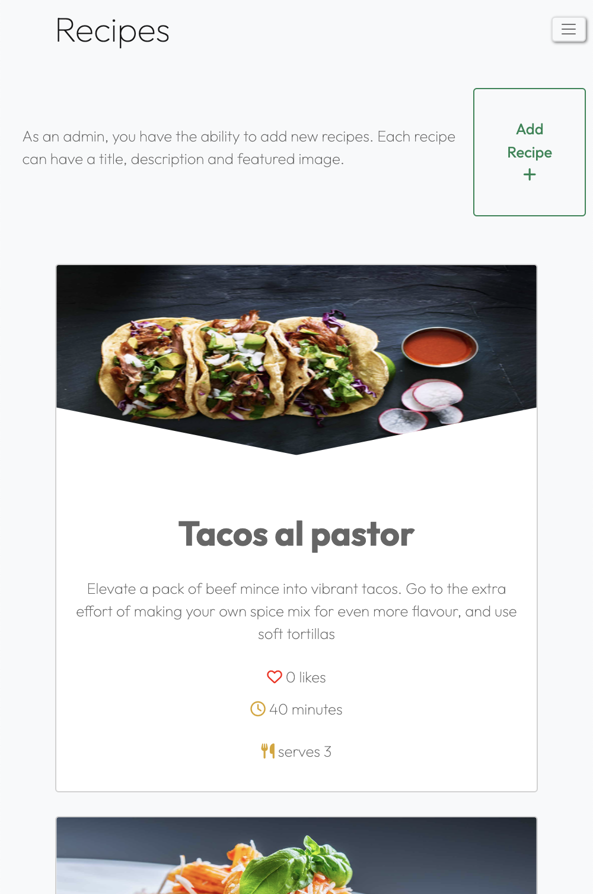
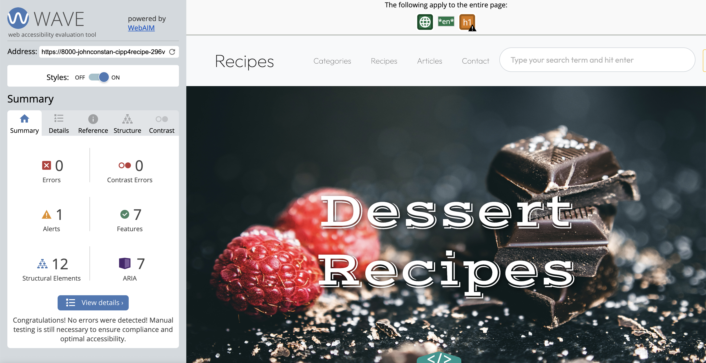

**Developer: John Constant**

💻 [Visit live website](https://ci-pp4-recipe-site.herokuapp.com/)

## Table of Contents
  - [About](#about)
  - [User Goals](#user-goals)
  - [Site Owner Goals](#site-owner-goals)
  - [User Experience](#user-experience)
  - [User Stories](#user-stories)
  - [Design](#design)
    - [Colours](#colours)
    - [Fonts](#fonts)
    - [Structure](#structure)
      - [Website pages](#website-pages)
      - [Database](#database)
    - [Wireframes](#wireframes)
  - [Technologies Used](#technologies-used)
  - [Features](#features)
  - [Validation](#validation)
  - [Testing](#testing)
    - [Manual testing of user stories](#manual-testing-of-user-stories)
    - [Automated testing](#automated-testing)
    - [Performing tests on various devices](#performing-tests-on-various-devices)
    - [Browser compatibility](#browser-compatibility)
  - [Bugs](#bugs)
  - [Configuration](#configuration)
    - [Google emails](#google-emails)
    - [Forking the GitHub Repository](#forking-the-github-repository)
    - [Making a Local Clone](#making-a-local-clone)
  - [Credits](#credits)
  - [Acknowledgements](#acknowledgements)

### Credentials
Superuser login details:
user1
user1@recipesite.com
EyHZiF6B8MWFFb4

### About

The Recipe Site application is designed for creating recipes and grouping them into categories for meal-time inspiration when you just don't know wht you want. The application also contains articles about the most recent food trends including topics suchs as restaurant reviews, tips and tricks on how to improve your cooking, step by step guides to cooking techniques or general news from the food world!

### User Goals

- To get inspiration for meal time prep
- To sort recipes by category
- To search through recipes
- To keep up to date with helpful articles
- To comment on and like recipes and articles
- To contact site administrators with recipe, category or article ideas

### Admin user Goals
- To create, update and delete all categories
- To create recipes and update and delete their own recipes
- To create, update and delete articles

### Site Owner Goals

- Provide an online solution for users to plan their meals
- Create visually appealing design
- Provide fully responsive application with straightforward navigation


## User Experience

### Target Audience
- People who don't know what they are going to eat
- Food enthusiasts looking to learn about the culinary world
- People looking to learn new recipes, tips, tricks or cooking techniques

### User Requirements and Expectations

- Straightforward navigation
- Easy to use
- A responsive application that allows the user to access the recipes and articles on any device
- Visually appealing design for all screen size
- Links and functions that work as expected
- An easy way to contact the developer
- Accessibility

##### Back to [top](#table-of-contents)


## User Stories

### Users
1. As a site user, I can create an account to interact with recipes
2. As a site user, I can view all recipes in one place
3. As a site user, I can view the most popular recipes on the home page
4. As a site user, I can view the featured recipes on the home page
5. As a site user, I can log in to comment on recipes and articles
6. As a site user, I can log in to like/unlike recipes
8. As a site user, I can log in using social media accounts/gmail to make registration easier
9. As a site user, I can view recipes organised by category to make finding particular recipes
10. As a site user, I can view comments on an individual recipe or article so that I can read the conversation
11. As a site user, I want to be aware of logged in status
12. As a site user, I want contact form/email subscription prefilled with account info
13. As a site user, I want to be able to search through the recipes

### Site admin
13. As a site admin, I can create, read, update and delete my recipes and articles to manage site content
14. As a site admin, I can approve or disapprove comments so that I can filter out objectionable comments
15. As a site admin, I can create, read, update and delete categories to organise site content
16. As a site admin, I can choose which recipes are featured on the home page
17. As a site admin, I want to be able to log into admin dashboard to edit recipes/categories/comments
18. As a site admin, I want edit forms prefilled with relevant info

### Site Owner
19. As a site owner, I want to increase my social media presence
20. As a site owner, I want visitors to share recipes on social media to increase visitors
21. As a site owner, I want data entry to be validated on sign-up page
22. As a site owner, I want the user to come to a 404 error page instead of having to use the browser back button if they enter a URL that does not exist
23. As a site owner, I want user to be able to contact me and provide their feedback

##### Back to [top](#table-of-contents)


## Design

### Fonts

Google Fonts were implemented on the website. Outfit with sans-serif as fallback was used thoughout the site to present the content in a clear and legible way for the body content. Vast Shadow with a sans-serif fallback was used for the main page headings.

### Structure

#### Website pages

Simplicity, clarity and ease of navigation between pages were the key aspects for design of this website's structure.

At the top of the page there is a recognisable type of navigation bar with website name on the left side and the navigation links to the right of it. The navigation bar also contains a search bar and login and register buttons when logged out and a friendly welcome message and sign ut button when authenticated. The menu collapses to hamburger icon on smaller screen sizes. At the bottom of the page there is a footer with links to social media pages(opening in a separate tab/window).

- The website consists of the following sections:
  - Home page with an overview of the content and aim of the website.
  - Categories page where the user can see a list of all the different recipe categories published
  - Category detail page where the related recipes are listed below the category description
  - Add category page allowing admin user to create a category.
  - Edit category page where admin user can edit an existing category.
  - Delete category allowing admin user to delete selected category.
  - Recipes page where the user can see a list of all the published recipes.
  - Recipe detail page where authenticated users can like or comment on recipes.
  - Add recipe page allowing admin user to create a recipe.
  - Edit recipe page where admin user can edit an existing recipe.
  - Delete recipe allowing admin user to delete selected recipe.
  - Articles page where the user can see a list of all the published articles.
  - Article detail page where authenticated users can like or comment on articles.
  - Add article page allowing admin user to create a article.
  - Edit article page where admin user can edit an existing article.
  - Delete article allowing admin user to delete selected article.
  - Login page for returning user to log in by email or social provider.
  - Register page allowing a new user to sign up by email or social provider.
  - Logout page allowing user to log out of the website.
  - Contact page with contact form which allows users to provide their feedback.
  - 404 error page.

#### Database

- The backend consists of Python built with the Django framework with a database of a Postgres for the deployed version
- Two database models contain all fields stored in the database and mimics the structure of what is actually stored in the Postgres database

<details><summary>Show diagram</summary>

</details>

The following models were created to represent the database model structure for the website:

##### User Model
- The User model contains information about the user. It is part of the Django allauth library

##### Category Model
- The Category model contains the following fields: title, description, featured_image and Recipe
- The model has a many-to-many relationship with Recipe

##### Recipe Model
- The Recipe model represents a specific recipe and contains its general information
- The Recipe model contains the following fields: title, description, featured image, categories, servings, prep time, cook time, difficulty, author, status, created date, last modified date, ingredients and instructions
- The model has a many-to-many relationship with Category
- It contains Ingredient as a foreign key
- It contains Instruction as a foreign key

##### Ingredient Model
- The Ingredient model represents an ingredinet for a specific recipe's ingredients
- The Ingredient model contains the following fields: name, amount, notes and recipe
- It contains Recipe as a foreign key

##### Instruction Model
- The Instruction model represents an instruction for a specific recipe's instructions
- The Instruction model contains the following fields: body and recipe
- It contains Recipe as a foreign key

##### Comment Model (Recipe)
- The Comment model represents a comment on a specific recipe
- The Comment model contains the following fields: name, email, body, created_date, approved and recipe
- It contains Recipe as a foreign key

##### Article Model
- The Article model represents a specific article and contains its general information
- The Article model contains the following fields: title, description, featured image, author, status, created date and last modified date.

### Wireframes

<details><summary>Home page</summary>

</details>
<details><summary>Categories page</summary>

</details>
<details><summary>Category detail page</summary>

</details>
<details><summary>Recipes page</summary>

</details>
<details><summary>Recipe detail page</summary>

</details>
<details><summary>Articles page</summary>

</details>
<details><summary>Article detail page</summary>

</details>
<details><summary>Contact page</summary>

</details>

## Technologies Used

### Languages & Frameworks

- HTML
- CSS
- Javascript
- Python 3.8.11
- Django 3.2.16


### Libraries & Tools

- [Am I Responsive](http://ami.responsivedesign.is/) was used to create the multi-device mock-up at the top of this README.md file
- [Balsamiq](https://balsamiq.com/) to create the projects wireframes
- [Bootstrap v5.2.3](https://getbootstrap.com/). This project uses the Bootstrap library for UI components (Buttons, Card, Footer, Modal, Pagination, Navbar)
- [Cloudinary](https://cloudinary.com/) to store static files
- [Dbdiagram.io](https://dbdiagram.io/home) used for the database schema diagram
- [Favicon.io](https://favicon.io) for making the site favicon
- [Chrome dev tools](https://developers.google.com/web/tools/chrome-devtools/) was used for debugging of the code and checking site for responsiveness
- [Font Awesome](https://fontawesome.com/) - Icons from Font Awesome were used throughout the site
- [Git](https://git-scm.com/) was used for version control within VSCode to push the code to GitHub
- [GitHub](https://github.com/) was used as a remote repository to store project code
- [Google Fonts](https://fonts.google.com/)
- [Heroku](https://heroku.com) was used to deploy the project into live environment
- [jQuery](https://jquery.com) was used for drop-down exercises filters on smaller screens
- [Elephant SQL](https://www.elephantsql.com/) – deployed project on Heroku uses an Elephant SQL database
- [Summernote](https://summernote.org/) - editor used for exercise description field in Admin page
- [Visual Studio Code (VSCode)](https://code.visualstudio.com/) - code editor used to write this project
- Validation:
  - [WC3 Validator](https://validator.w3.org/) was used to validate the html in the project
  - [Jigsaw W3 Validator](https://jigsaw.w3.org/css-validator/) to validate the css in the project
  - [JShint](https://jshint.com/) for JavaScript quality
  - [Lighthouse](https://developers.google.com/web/tools/lighthouse/) for performance, accessibility, progressive web apps, SEO analysis of the project code
  - [Wave Validator](https://wave.webaim.org/) to evaluate accessibility

##### Back to [top](#table-of-contents)


## Features

### Logo and Navigation Bar
- Featured and consistent on the all pages
- The nav bar contains links to Home page, Planner page, Exercise page and Profile page.
  - Logged-in users will see their name in the nav bar with option on click to either view their profile or log out
  - Not logged in users will have option to either register or log in
- The nav bar is fully responsive and changes to a toggler (hamburger menu) on smaller size screens
- The navbar allows user to easily jump to a specific section on the website
- User stories covered: 2, 18

<details><summary>See feature images</summary>


</details>


### Home page
- Home page includes nav bar, main body and a footer
- Home page main body includes the featured recipes section, a description of the website and what its users can find and expect, the most popular recipes section, most recent categories section, most recent articles section and sign up form. 
- User stories covered: 1

<details><summary>See feature images</summary>


</details>


### Footer
- A footer is displayed at the bottom of the each page
- Contains links to social media sites (opening in a separate window)
- Contains copyrights info
- User stories covered: 16

<details><summary>See feature images</summary>


</details>


### Sign up / Register
- New users can create an account
- The user must provide a valid username, password and password confirmation. Email address is optional
- Users can register for an account with Google and Facebook social sign on
- User cannot register the same details twice for an account
- Once register the users are immediately logged in and taken to the home page
- User stories covered: 3, 14

<details><summary>See feature images</summary>


</details>


### Login
- Returning users can login to their account
- The user must have an account in the system and they must enter the correct username and password
- Users can sign in to there account with Google and Facebook social sign on
- Both fields are mandatory
- Once logged in the user will be navigated to the planner page
- User stories covered: 10, 12, 14

<details><summary>See feature images</summary>


</details>


### Logout
- Confirmation screen for Logged in user to logout from their account 
- User stories covered: 21

<details><summary>See feature images</summary>


</details>


### Categories page
- There are two views depending whether a user is logged in or not
  - Users who are logged in as admins can see the option to add a category. 
  - Logged-in users and unauthenticated users will not have the ability to add catgories and therefore won't see this section of the page.
- User stories covered: 3, 10, 12
<details><summary>See feature images</summary>


</details>


### Category detail page
- There are two views depending whether a user is logged in or not
  - Users who are logged in as admins can see the option to edit or delete a category under the general category information. 
  - Logged-in users and unauthenticated users will not have the ability to edit or delte catgories and therefore won't see this section of the page.
- Visitors to this page will see the featured image, a category description where applicable and the related recipes listed below in card format.
- User stories covered: 3, 10, 12
<details><summary>See feature images</summary>


</details>


### Add Category page
- Logged in admin users have the ability to add recipe categories.
- Admin users will add a name, description, fetured image and choose whether to publish the category immediately or not.
- It is possible to leave some fields blank.
- For easier use on small screen devices the form increases to full screen width.
- User is provided with a feedback message that their category has been added.
- User stories covered: 4, 13
  
<details><summary>See feature images</summary>


</details>

### Edit Category page
- Admin users can edit the information of any category.
- The Edit category page is based off of the Add Category page.
- Fields are prepopulated with the information from the selected category.
- User is provided with a feedback message that their category has been updated.
- User stories covered: 4, 8

<details><summary>See feature images</summary>


</details>


### Deleting a Category
- Located on the category detail page, admin users can delete existing categories.
- Defensive programming principles applied by presenting user with a modal to confirm deletion.
- User is provided with a feedback message that their category has been deleted.
- User stories covered: 5, 6

<details><summary>See feature images</summary>


</details>


### Recipes page
- This page lists all of the recipes in the database ordered by created date.
- There are two views depending whether a user is logged in or not.
  - Users who are logged in as admins can see the option to add a recipe. 
  - Logged-in users and unauthenticated users will not have the ability to add catgories and therefore won't see this section of the page.
- User stories covered: 3, 10, 12
<details><summary>See feature images</summary>



</details>

### Recipe detail page
- There are two views depending whether a user is logged in or not
  - If logged in as the author of the recipe, the user will have the ability to edit or delete that recipe.
  - Logged-in users and unauthenticated users will not have the ability to edit or delte recipes and therefore won't see this section of the page.
- Visitors to this page will see the featured image, recipe title, general recipe information, recipe description steps and ingredients.
- Logged in users will have the ability to like a recipe.
- Logged in users will also be able to comment on a recipe.
- User stories covered: 3, 10, 12
<details><summary>See feature images</summary>


</details>

### Like a recipe
- Logged in users can like a recipe if they choose.
- Recipes will display the number of likes on their recipe cards and on the recipe detail page.
- The number of likes messaging is dynamic and the messaging changes based on the number of likes
- User stories covered: 
<details><summary>See feature images</summary>


</details>

### Comment on a recipe
- Logged in users can comment on a recipe and join a conversation.
- Comments will be displayed on the recipe page beneath the instructions.
- User is provided with a feedback message that their comment has been updated.
- User stories covered: 
<details><summary>See feature images</summary>


</details>

### Add recipe page
- Logged in admin users have the ability to add recipes.
- Admin users will add a name, general information, fetured image and choose whether to publish the category immediately or not.
- It is possible to leave some fields blank.
- For easier use on small screen devices the form increases to full screen width.
- User is provided with a feedback message that their category has been added.
- User stories covered: 4, 13
  
<details><summary>See feature images</summary>


</details>

### Edit recipe page
- Admin users can edit the information of any recipe.
- The Edit recipe page is based off of the Add recipe page.
- Fields are prepopulated with the information from the selected recipe.
- User is provided with a feedback message that their recipe has been updated.
- User stories covered: 4, 8

<details><summary>See feature images</summary>


</details>


### Deleting a Recipe
- Located on the recipe detail page, admin users can delete existing recipes.
- Defensive programming principles applied by presenting user with a modal to confirm deletion.
- User is provided with a feedback message that their recipe has been deleted.
- User stories covered: 5, 6

<details><summary>See feature images</summary>


</details>


### Articles page
- This page lists all of the articles in the database ordered by created date.
- There are two views depending whether a user is logged in or not.
  - Users who are logged in as admins can see the option to add a article. 
  - Logged-in users and unauthenticated users will not have the ability to add catgories and therefore won't see this section of the page.
- User stories covered: 3, 10, 12
<details><summary>See feature images</summary>


</details>

### Article detail page
- There are two views depending whether a user is logged in or not
  - If logged in as the author of the article, the user will have the ability to edit or delete that article.
  - Logged-in users and unauthenticated users will not have the ability to edit or delte articles and therefore won't see this section of the page.
- Visitors to this page will see the featured image, article title, general article information, article description steps and ingredients.
- Logged in users will have the ability to like a article.
- Logged in users will also be able to comment on a article.
- User stories covered: 3, 10, 12
<details><summary>See feature images</summary>


</details>

### Like an article
- Logged in users can like a article if they choose.
- Articles will display the number of likes on the article detail page.
- The number of likes messaging is dynamic and the messaging changes based on the number of likes
- User stories covered: 
<details><summary>See feature images</summary>


</details>

### Comment on an article
- Logged in users can comment on an article and join a conversation.
- Comments will be displayed on the article page beneath the instructions.
- User is provided with a feedback message that their comment has been updated.
- User stories covered: 
<details><summary>See feature images</summary>


</details>

### Add an article page
- Logged in admin users have the ability to add articles.
- Admin users will add a name, general information, fetured image and choose whether to publish the category immediately or not.
- It is possible to leave some fields blank.
- For easier use on small screen devices the form increases to full screen width.
- User is provided with a feedback message that their category has been added.
- User stories covered: 4, 13
  
<details><summary>See feature images</summary>


</details>

### Edit article page
- Admin users can edit the information of any article.
- The Edit article page is based off of the Add article page.
- Fields are prepopulated with the information from the selected article.
- User is provided with a feedback message that their article has been updated.
- User stories covered: 4, 8

<details><summary>See feature images</summary>


</details>


### Deleting an article
- Located on the article detail page, admin users can delete existing articles.
- Defensive programming principles applied by presenting user with a modal to confirm deletion.
- User is provided with a feedback message that their article has been deleted.
- User stories covered: 5, 6

<details><summary>See feature images</summary>


</details>


### Feedback messages
- User is provided with feedback message about the action their performed, eg. added, edited or deleted a plan or logged-in, registered, logged-out, etc.
- User stories covered: 7

<details><summary>See feature images</summary>


</details>


### Contact form
- Contact form allows user to contact the developer and send their message or provide feedback
- USers are asked for name, email, message topic and message as well as optional email subscription
- Username on the form is automatically provided for the logged-in user.
- User stories covered: 16

<details><summary>See feature images</summary>


</details>


### Error pages
- If a user encounters an error, the relevant error page is displayed (400, 403, 404 or 500)
- User stories covered: 15

<details><summary>See feature images</summary>


</details>

##### Back to [top](#table-of-contents)


## Validation

The W3C Markup Validation Service was used to validate the HTML of the website.
<details><summary>Home</summary>

</details>

<details><summary>Categories</summary>

</details>

<details><summary>Category detail</summary>

</details>

<details><summary>Recipes</summary>

</details>

<details><summary>Recipes detail page</summary>
 
</details>

<details><summary>Login</summary>

</details>

<details><summary>Signup</summary>

</details>

<details><summary>Logout</summary>

</details>

<details><summary>Contact form page</summary>

</details>

<details><summary>Error Pages (400, 403, 404, 500)</summary>
 
</details>


### CSS Validation
The W3C Jigsaw CSS Validation Service was used to validate the CSS of the website. When validating all website, it passes with no errors.

<details><summary>Style.css</summary>

</details>

### JavaScript Validation
JSHint JS Validation Service was used to validate the Javascript files. No errors were found.

<details><summary>Script.js</summary>

</details>

### PEP8 Validation
PEP8 Validation Service was used to check the code for PEP8 requirements. All the code passes with no errors and no warnings to show.

All python files are pep8 compliant except for settings.py which has 5 issues. Files were checked using the pycodestyle python package.

<details><summary>Validation</summary>

</details>


### Wave
The WAVE WebAIM web accessibility evaluation tool was used to test the websites accessibility.

<details><summary>Home page</summary>

</details>

<details><summary>Contact page</summary>

</details>

<details><summary>Register page</summary>

</details>

<details><summary>Login page</summary>

</details>

<details><summary>Categories list page</summary>

</details>

<details><summary>Category detail page</summary>

</details>

<details><summary>Add category page</summary>  

</details>

<details><summary>Edit category page</summary>

</details>

<details><summary>Recipes list page</summary>

</details>

<details><summary>Recipe detail page</summary>

</details>

<details><summary>Add recipe page</summary>  

</details>

<details><summary>Edit recipe page</summary>

</details>

<details><summary>Articles list page</summary>

</details>

<details><summary>Article detail page</summary>

</details>

<details><summary>Add article page</summary>  

</details>

<details><summary>Edit article page</summary>

</details>

##### Back to [top](#table-of-contents)


## Testing

The testing approach is as follows:
1. Manual testing of user stories
2. Automated testing

### Manual testing of user stories

### Users
1. I want to see the home page with explanation of the app

**Step** | **Expected Result** | **Actual Result**
------------ | ------------ | ------------ |
Navigate to https://ci-pp4-recipe-site.herokuapp.com/ | Home page main body loads with application description | Works as expected |

<details><summary>Screenshot</summary>

</details>


2. As a site user, I can create an account to interact with recipes

**Step** | **Expected Result** | **Actual Result**
------------ | ------------ | ------------ |
Navigate to https://ci-pp4-recipe-site.herokuapp.com/accounts/signup/ and fill submit form | account is created for the user with the submitted details | Works as expected |
Navigate to https://ci-pp4-recipe-site.herokuapp.com/accounts/signup/ and click sign up with Google button | account is created for the user with details from Google account | Works as expected |
Navigate to https://ci-pp4-recipe-site.herokuapp.com/accounts/signup/ and click sign up with Facebook button | account is created for the user with details from Facebook account | Works as expected |

<details><summary>Screenshot</summary>


</details>

3. As a site user, I can view all recipes in one place

**Step** | **Expected Result** | **Actual Result**
------------ | ------------ | ------------ |
Navigate to https://ci-pp4-recipe-site.herokuapp.com//recipes/ | Recipes page main body loads with all recipes displayed | Works as expected |

<details><summary>Screenshot</summary>


</details>


4. As a site user, I can view the most popular recipes on the home page

**Step** | **Expected Result** | **Actual Result**
------------ | ------------ | ------------ |
Navigate to https://ci-pp4-recipe-site.herokuapp.com// and scroll to most popular recipes section | Recipes with likes appear in three panels on homepage | Works as expected |
Click on most popular panel | Brought to recipe detail page for more information on recipe | Works as expected |

<details><summary>Screenshot</summary>

</details>


5. As a site user, I can view the featured recipes on the home page

**Step** | **Expected Result** | **Actual Result**
------------ | ------------ | ------------ |
Navigate to https://ci-pp4-recipe-site.herokuapp.com// | 5 featured recipes appearing on homepage carousel | Works as expected |
Click on most carousel slide | Brought to recipe detail page for more information on recipe | Works as expected |

<details><summary>Screenshot</summary>


</details>


6. As a site user, I can log in to comment on recipes and articles

**Step** | **Expected Result** | **Actual Result**
------------ | ------------ | ------------ |
Navigate to https://ci-pp4-recipe-site.herokuapp.com/accounts/login/ and fill submit form | account is created for the user with the submitted details | Works as expected |
Navigate to https://ci-pp4-recipe-site.herokuapp.com/accounts/login/ and click log in with Google button | account is created for the user with details from Google account | Works as expected |
Navigate to https://ci-pp4-recipe-site.herokuapp.com/accounts/login/ and click log in with Github button | account is created for the user with details from Github account | Works as expected |
Once logged in go to recipe page, scroll to comments section and leave a comment | Comment is submitted for approval | Works as expected

<details><summary>Screenshot</summary>


</details>


7. As a site user, I can log in to like/unlike recipes

**Step** | **Expected Result** | **Actual Result**
------------ | ------------ | ------------ |
Navigate to https://ci-pp4-recipe-site.herokuapp.com/accounts/login/ and fill submit form | account is created for the user with the submitted details | Works as expected |
Navigate to https://ci-pp4-recipe-site.herokuapp.com/accounts/login/ and click log in with Google button | account is created for the user with details from Google account | Works as expected |
Navigate to https://ci-pp4-recipe-site.herokuapp.com/accounts/login/ and click log in with Facebook button | account is created for the user with details from Facebook account | Works as expected |
Once logged in go to recipe page, scroll to info section and click heart icon | Icon changes to solid heart and number of likes count increases by one | Works as expected

<details><summary>Screenshot</summary>


</details>


8. As a site user, I can log in using social media accounts/gmail to make registration easier

**Step** | **Expected Result** | **Actual Result**
------------ | ------------ | ------------ |
Navigate to https://ci-pp4-recipe-site.herokuapp.com/accounts/login/ and click log in with Google button | account is created for the user with details from Google account | Works as expected |
Navigate to https://ci-pp4-recipe-site.herokuapp.com/accounts/login/ and click log in with Facebook button | account is created for the user with details from Facebook account | Works as expected |

<details><summary>Screenshot</summary>


</details>

9. As a site user, I can view recipes organised by category to make finding particular recipes

**Step** | **Expected Result** | **Actual Result**
------------ | ------------ | ------------ |
Navigate to https://ci-pp4-recipe-site.herokuapp.com//categories/ | Category page loads | Works as expected |
Click on category panel tile for category detail page | Category detail page loads with related recipes displayed at the bottom of the page | Works as expected |

<details><summary>Screenshot</summary>


</details>

10. As a site user, I can view and leave comments on an individual recipe or article

**Step** | **Expected Result** | **Actual Result**
------------ | ------------ | ------------ |
Navigate to https://ci-pp4-recipe-site.herokuapp.com//recipes/ | Recipe page loads | Works as expected |
Click on recipe card for more information | Recipe detail page loads with comments section at the bottom of the page | Works as expected |
Logged in users can fill out the comment form and click submit button | Comment is submitted for approval | Works as expected |
Admin user approves comment in admin dashboard | Approved comments are displayed on the recipes page | Works as expected |

<details><summary>Screenshot</summary>


</details>

11. As a site user, I want to be aware of logged in status

**Step** | **Expected Result** | **Actual Result**
------------ | ------------ | ------------ |
Navigate to any page and check nav bar | Logged in users see welcome message with personalised username and sign out link | Works as expected |
Navigate to any page and check nav bar | Unauthenticated users see welcome message with register and sign in links | Works as expected |

<details><summary>Screenshot</summary>


</details>

12. As a site user, I want contact form/email subscription prefilled with account info

**Step** | **Expected Result** | **Actual Result**
------------ | ------------ | ------------ |
Navigate to https://ci-pp4-recipe-site.herokuapp.com/contact | Logged in users see username field of form prepopulated | Works as expected |

<details><summary>Screenshot</summary>


</details>

13. As a site user, I want to be able to search through the recipes, categories and articles

**Step** | **Expected Result** | **Actual Result**
------------ | ------------ | ------------ |
Click on search bar in navbar and enter search term | Search results are displayed on resulting page | Works as expected |

<details><summary>Screenshot</summary>


</details>

### Site admin
14. As a site admin, I can create, read, update and delete my recipes and articles to manage site content

**Step** | **Expected Result** | **Actual Result**
------------ | ------------ | ------------ |
Navigate to https://ci-pp4-recipe-site.herokuapp.com/admin logged in as superuser | Admin dashboard is displayed | Works as expected |
Click on Recipe add + button | Recipe add form is presented to user in backend | Works as expected |
Fill out form with relevant details and click save | New recipe is added to database | Works as expected |
Navigate to https://ci-pp4-recipe-site.herokuapp.com/recipes logged in as superuser | Add recipe button is displayed above recipe list | Works as expected |
Click on Recipe add + button | Recipe add form is presented to user in frontend | Works as expected |
Fill out form with relevant details and click save | New recipe is added to database | Works as expected |
Navigate to https://ci-pp4-recipe-site.herokuapp.com/admin logged in as superuser | Admin dashboard is displayed | Works as expected |
Click on Article add + button | Article add form is presented to user in backend | Works as expected |
Fill out form with relevant details and click save | New article is added to database | Works as expected |
Navigate to https://ci-pp4-recipe-site.herokuapp.com/articles logged in as superuser | Add article button is displayed above article list | Works as expected |
Click on Article add + button | Article add form is presented to user in frontend | Works as expected |
Fill out form with relevant details and click save | New article is added to database | Works as expected |

<details><summary>Screenshot</summary>


</details>

15. As a site admin, I can approve or disapprove comments so that I can filter out objectionable comments

**Step** | **Expected Result** | **Actual Result**
------------ | ------------ | ------------ |
Navigate to https://ci-pp4-recipe-site.herokuapp.com/admin logged in as superuser | Admin dashboard is displayed | Works as expected |
Click on Comments table | A list of all comments is displayed | Works as expected |
Select the commetns for approval from list and approve | Approved comments are displayed on the front end of the website | Works as expected |

<details><summary>Screenshot</summary>


</details>

16. As a site admin, I can create, read, update and delete categories to organise site content

**Step** | **Expected Result** | **Actual Result**
------------ | ------------ | ------------ |
Navigate to https://ci-pp4-recipe-site.herokuapp.com/admin logged in as superuser | Admin dashboard is displayed | Works as expected |
Click on Category add + button | Category add form is presented to user in backend | Works as expected |
Fill out form with relevant details and click save | New category is added to database | Works as expected |
Navigate to https://ci-pp4-recipe-site.herokuapp.com/categories logged in as superuser | Add category button is displayed above category list | Works as expected |
Click on Category add + button | Category add form is presented to user in frontend | Works as expected |
Fill out form with relevant details and click save | New category is added to database | Works as expected |

<details><summary>Screenshot</summary>


</details>

17. As a site admin, I can choose which recipes are featured on the home page

Navigate to https://ci-pp4-recipe-site.herokuapp.com/admin logged in as superuser | Admin dashboard is displayed | Works as expected |
Choose your recipe from the Recipes table | Recipe edit form is presented to user in backend | Works as expected |
Select the featured recipe checkbox and click save | New recipe is appearing on the home page carousel | Works as expected |
Navigate to https://ci-pp4-recipe-site.herokuapp.com/recipes logged in as superuser | Add recipe button is displayed above recipe list | Works as expected |
Choose your recipe from the Recipes table | Recipe edit form is presented to user in frontend | Works as expected |
Select the featured recipe checkbox and click save | New recipe is appearing on the home page carousel | Works as expected |


<details><summary>Screenshot</summary>


</details>

18. As a site admin, I want to be able to log into admin dashboard to edit recipes/categories/comments

Navigate to https://ci-pp4-recipe-site.herokuapp.com/admin | Admin sign in form is displayed | Works as expected |
Once logged in Recipes, Categories and articles tables are available | App tables are displayed | Works as expected |

<details><summary>Screenshot</summary>


</details>

19. As a site admin, I want edit forms prefilled with relevant info

**Step** | **Expected Result** | **Actual Result**
------------ | ------------ | ------------ |
Navigate to https://ci-pp4-recipe-site.herokuapp.com/admin logged in as superuser | Admin dashboard is displayed | Works as expected |
Choose a recipe from the Recipes table | Recipe edit form is presented with data prefilled | Works as expected |

Navigate to https://ci-pp4-recipe-site.herokuapp.com/recipes logged in as superuser | Choose recipe from list | Works as expected |
If logged in user is recipe author edit and delete buttons are available | Edit and Delete buttons are available to recipe author on recipe detail page | Works as expected |
Click on edit button | Recipe edit form is presented with data prefilled | Works as expected |

<details><summary>Screenshot</summary>


</details>

### Site Owner
20. As a site owner, I want to increase my social media presence

**Step** | **Expected Result** | **Actual Result**
------------ | ------------ | ------------ |
Navigate to the any page, scroll to bottom of page | Links bring user to social media page where they can follow restaurant | Works as expected |

<details><summary>Screenshot</summary>


</details>

21. As a site owner, I want data entry to be validated on sign-up page

22. As a site owner, I want the user to come to a 404 error page instead of having to use the browser back button if they enter a URL that does not exist

**Step** | **Expected Result** | **Actual Result**
------------ | ------------ | ------------ |
Type the wrong page in the www address | Reroute to a customised 404 page | Works as expected |

<details><summary>Screenshot</summary>

</details>

23. As a site owner, I want user to be able to contact me and provide their feedback

**Step** | **Expected Result** | **Actual Result**
Navigate to the contact page, scroll down to contact form | Form allows user to make contact and provide feedback | Works as expected |

<details><summary>Screenshot</summary>


</details>

### Automated testing

Automated testing was done using the Django's unit tests from a Python standard library module: unittest. 

### Performing tests on various devices

The website was tested using Google Chrome Developer Tools Toggle Device Toolbar to simulate viewports of different devices.

The website was tested on the following devices:
- MacBook Pro
- Dell on latest Windows OS
- Nord One Plus

### Browser compatibility

- Testing has been carried out on the following browsers:
  - Google Chrome
  - Safari
  - Firefox
  - Microsoft Edge
  - Android Native Browser
  - Google Chrome on Android


##### Back to [top](#table-of-contents)


## Bugs

| **Bug** | **Fix** |
| ------- | ------- |
| The post method on the RecipeUpdate class is not working correctly | Update RecipeUpdate to be function based view and use inline formset to update ingredients and instructions |
| Placeholder image not working on cards | Implement conditional statement on card |

## Future Considerations

| **Feature** | 
| ------- | 
| Fix Recipe Udate view | 
| Make Recipe form more dynamic by allowing user choose how many instruction and ingredient fields |


##### Back to [top](#table-of-contents)


## Configuration

### Forking the GitHub Repository
1. Go to the GitHub repository
2. Click on Fork button in top right corner
3. You will then have a copy of the repository in your own GitHub account.
   
### Making a Local Clone
1. Go to the GitHub repository 
2. Locate the Code button above the list of files and click it
3. Highlight the "HTTPS" button to clone with HTTPS and copy the link
4. Open commandline interface on your computer
5. Change the current working directory to the one where you want the cloned directory
6. Type git clone and paste the URL from the clipboard 
  ```
  $ git clone https://github.com/aleksandracodes/CI_PP4_Workout_Planner
  ```
7. Press Enter to create your local clone

##### Back to [top](#table-of-contents)


## Credits

### Images

**Images used in this app were found on Shutterstock and Envato. I'm not able to list all the sources but would like to emphasise that I'm not the author of any of them.**


### Code
- Django all-auth social sign on [tutorial](https://learndjango.com/tutorials/django-allauth-tutorial)
- Django all-auth [documentation](https://django-allauth.readthedocs.io/en/latest/index.html)
- swapps Nested forms [tutorial](https://swapps.com/blog/working-with-nested-forms-with-django)
- Django inline formsets [tutorial](https://www.letscodemore.com/blog/django-inline-formset-factory-with-examples/)
- [inline_formsets](https://techincent.com/explained-django-inline-formset-factory-with-example/)
- [WorkoutPlanner](https://github.com/aleksandracodes/CI_PP4_Workout_Planner/blob/main/README.md) by Aleksandracoodes
- Instagram logo graident(https://stackoverflow.com/questions/37751375/instagram-new-logo-css-background)
- Gradient text(https://css-tricks.com/snippets/css/gradient-text/)
)
##### Back to [top](#table-of-contents)

## Acknowledgements

I would like to thank everyone who supported me in the development of this project:
- My mentor Mo for professional guidance and helpful feedback
- Aleksandra Haniok whose past project was amazing inspiration and guidance