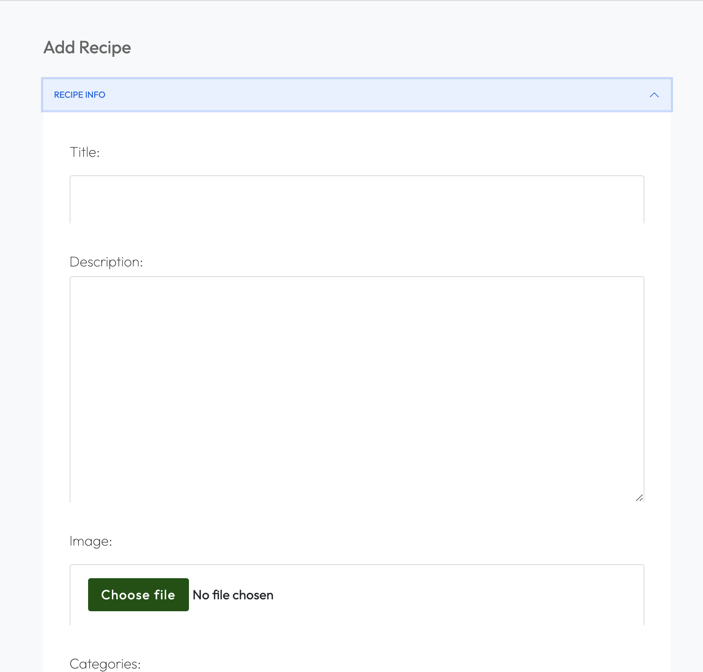

**Developer: John Constant**

💻 [Visit live website](https://ci-pp4-recipe-site.herokuapp.com/)


## Table of Contents
  - [About](#about)
  - [User Goals](#user-goals)
  - [Site Owner Goals](#site-owner-goals)
  - [User Experience](#user-experience)
  - [User Stories](#user-stories)
  - [Design](#design)
    - [Colours](#colours)
    - [Fonts](#fonts)
    - [Structure](#structure)
      - [Website pages](#website-pages)
      - [Database](#database)
    - [Wireframes](#wireframes)
  - [Technologies Used](#technologies-used)
  - [Features](#features)
  - [Validation](#validation)
  - [Testing](#testing)
    - [Manual testing of user stories](#manual-testing-of-user-stories)
    - [Automated testing](#automated-testing)
    - [Performing tests on various devices](#performing-tests-on-various-devices)
    - [Browser compatibility](#browser-compatibility)
  - [Bugs](#bugs)
  - [Configuration](#configuration)
    - [Google emails](#google-emails)
    - [Forking the GitHub Repository](#forking-the-github-repository)
    - [Making a Local Clone](#making-a-local-clone)
  - [Credits](#credits)
  - [Acknowledgements](#acknowledgements)

### About

The Recipe Site application is designed for creating recipes and grouping them into categories for meal-time inspiration when you just don't know wht you want. The application also contains articles about the most recent food trends including topics suchs as restaurant reviews, tips and tricks on how to improve your cooking, step by step guides to cooking techniques or general news from the food world!

### User Goals

- To get inspiration for meal time prep
- To sort recipes by category
- To search through recipes
- To keep up to date with helpful articles
- To comment on and like recipes and articles
- To contact site administrators with recipe, category or article ideas

### Admin user Goals
- To create, update and delete all categories
- To create recipes and update and delete their own recipes
- To create, update and delete articles

### Site Owner Goals

- Provide an online solution for users to plan their meals
- Create visually appealing design
- Provide fully responsive application with straightforward navigation


## User Experience

### Target Audience
- People who don't know what they are going to eat
- Food enthusiasts looking to learn about the culinary world
- People looking to learn new recipes, tips, tricks or cooking techniques

### User Requirements and Expectations

- Straightforward navigation
- Easy to use
- A responsive application that allows the user to access the recipes and articles on any device
- Visually appealing design for all screen size
- Links and functions that work as expected
- An easy way to contact the developer
- Accessibility

##### Back to [top](#table-of-contents)


## User Stories

### Users
1. As a site user, I can create an account to interact with recipes
2. As a site user, I can view all recipes in one place
3. As a site user, I can view the most popular recipes on the home page
4. As a site user, I can view the featured recipes on the home page
5. As a site user, I can log in to comment on recipes and articles
6. As a site user, I can log in to like/unlike recipes
8. As a site user, I can log in using social media accounts/gmail to make registration easier
9. As a site user, I can view recipes organised by category to make finding particular recipes
10. As a site user, I can view comments on an individual recipe or article so that I can read the conversation
11. As a site user, I want to be aware of logged in status
12. As a site user, I want contact form/email subscription prefilled with account info
13. As a site user, I want to be able to search through the recipes

### Site admin
13. As a site admin, I can create, read, update and delete my recipes and articles to manage site content
14. As a site admin, I can approve or disapprove comments so that I can filter out objectionable comments
15. As a site admin, I can create, read, update and delete categories to organise site content
16. As a site admin, I can choose which recipes are featured on the home page
17. As a site admin, I want to be able to log into admin dashboard to edit recipes/categories/comments
18. As a site admin, I want edit forms prefilled with relevant info

### Site Owner
19. As a site owner, I want to increase my social media presence
20. As a site owner, I want visitors to share recipes on social media to increase visitors
21. As a site owner, I want data entry to be validated on sign-up page
22. As a site owner, I want the user to come to a 404 error page instead of having to use the browser back button if they enter a URL that does not exist
23. As a site owner, I want user to be able to contact me and provide their feedback

##### Back to [top](#table-of-contents)


## Design

### Fonts

Google Fonts were implemented on the website. Outfit with sans-serif as fallback was used thoughout the site to present the content in a clear and legible way for the body content. Vast Shadow with a sans-serif fallback was used for the main page headings.

### Structure

#### Website pages

Simplicity, clarity and ease of navigation between pages were the key aspects for design of this website's structure.

At the top of the page there is a recognisable type of navigation bar with website name on the left side and the navigation links to the right of it. The navigation bar also contains a search bar and login and register buttons when logged out and a friendly welcome message and sign ut button when authenticated. The menu collapses to hamburger icon on smaller screen sizes. At the bottom of the page there is a footer with links to social media pages(opening in a separate tab/window).

- The website consists of the following sections:
  - Home page with an overview of the content and aim of the website.
  - Categories page where the user can see a list of all the different recipe categories published
  - Category detail page where the related recipes are listed below the category description
  - Add category page allowing admin user to create a category.
  - Edit category page where admin user can edit an existing category.
  - Delete category allowing admin user to delete selected category.
  - Recipes page where the user can see a list of all the published recipes.
  - Recipe detail page where authenticated users can like or comment on recipes.
  - Add recipe page allowing admin user to create a recipe.
  - Edit recipe page where admin user can edit an existing recipe.
  - Delete recipe allowing admin user to delete selected recipe.
  - Articles page where the user can see a list of all the published articles.
  - Article detail page where authenticated users can like or comment on articles.
  - Add article page allowing admin user to create a article.
  - Edit article page where admin user can edit an existing article.
  - Delete article allowing admin user to delete selected article.
  - Login page for returning user to log in by email or social provider.
  - Register page allowing a new user to sign up by email or social provider.
  - Logout page allowing user to log out of the website.
  - Contact page with contact form which allows users to provide their feedback.
  - 404 error page.

#### Database

- The backend consists of Python built with the Django framework with a database of a Postgres for the deployed version
- Two database models contain all fields stored in the database and mimics the structure of what is actually stored in the Postgres database

<details><summary>Show diagram</summary>

</details>

The following models were created to represent the database model structure for the website:

##### User Model
- The User model contains information about the user. It is part of the Django allauth library

##### Category Model
- The Category model contains the following fields: title, description, featured_image and Recipe
- The model has a many-to-many relationship with Recipe

##### Recipe Model
- The Recipe model represents a specific recipe and contains its general information
- The Recipe model contains the following fields: title, description, featured image, categories, servings, prep time, cook time, difficulty, author, status, created date, last modified date, ingredients and instructions
- The model has a many-to-many relationship with Category
- It contains Ingredient as a foreign key
- It contains Instruction as a foreign key

##### Ingredient Model
- The Ingredient model represents an ingredinet for a specific recipe's ingredients
- The Ingredient model contains the following fields: name, amount, notes and recipe
- It contains Recipe as a foreign key

##### Instruction Model
- The Instruction model represents an instruction for a specific recipe's instructions
- The Instruction model contains the following fields: body and recipe
- It contains Recipe as a foreign key

##### Comment Model (Recipe)
- The Comment model represents a comment on a specific recipe
- The Comment model contains the following fields: name, email, body, created_date, approved and recipe
- It contains Recipe as a foreign key

##### Article Model
- The Article model represents a specific article and contains its general information
- The Article model contains the following fields: title, description, featured image, author, status, created date and last modified date.

### Wireframes

<details><summary>Home page</summary>

</details>
<details><summary>Categories page</summary>

</details>
<details><summary>Category detail page</summary>

</details>
<details><summary>Recipes page</summary>

</details>
<details><summary>Recipe detail page</summary>

</details>
<details><summary>Articles page</summary>

</details>
<details><summary>Article detail page</summary>

</details>
<details><summary>Contact page</summary>

</details>

## Technologies Used

### Languages & Frameworks

- HTML
- CSS
- Javascript
- Python 3.8.11
- Django 3.2.16


### Libraries & Tools

- [Am I Responsive](http://ami.responsivedesign.is/) was used to create the multi-device mock-up at the top of this README.md file
- [Balsamiq](https://balsamiq.com/) to create the projects wireframes
- [Bootstrap v5.2.3](https://getbootstrap.com/). This project uses the Bootstrap library for UI components (Buttons, Card, Footer, Modal, Pagination, Navbar)
- [Cloudinary](https://cloudinary.com/) to store static files
- [Dbdiagram.io](https://dbdiagram.io/home) used for the database schema diagram
- [Favicon.io](https://favicon.io) for making the site favicon
- [Chrome dev tools](https://developers.google.com/web/tools/chrome-devtools/) was used for debugging of the code and checking site for responsiveness
- [Font Awesome](https://fontawesome.com/) - Icons from Font Awesome were used throughout the site
- [Git](https://git-scm.com/) was used for version control within VSCode to push the code to GitHub
- [GitHub](https://github.com/) was used as a remote repository to store project code
- [Google Fonts](https://fonts.google.com/)
- [Heroku](https://heroku.com) was used to deploy the project into live environment
- [jQuery](https://jquery.com) was used for drop-down exercises filters on smaller screens
- [Elephant SQL](https://www.elephantsql.com/) – deployed project on Heroku uses an Elephant SQL database
- [Summernote](https://summernote.org/) - editor used for exercise description field in Admin page
- [Visual Studio Code (VSCode)](https://code.visualstudio.com/) - code editor used to write this project
- Validation:
  - [WC3 Validator](https://validator.w3.org/) was used to validate the html in the project
  - [Jigsaw W3 Validator](https://jigsaw.w3.org/css-validator/) to validate the css in the project
  - [JShint](https://jshint.com/) for JavaScript quality
  - [Lighthouse](https://developers.google.com/web/tools/lighthouse/) for performance, accessibility, progressive web apps, SEO analysis of the project code
  - [Wave Validator](https://wave.webaim.org/) to evaluate accessibility

##### Back to [top](#table-of-contents)


## Features

### Logo and Navigation Bar
- Featured and consistent on the all pages
- The nav bar contains links to Home page, Planner page, Exercise page and Profile page.
  - Logged-in users will see their name in the nav bar with option on click to either view their profile or log out
  - Not logged in users will have option to either register or log in
- The nav bar is fully responsive and changes to a toggler (hamburger menu) on smaller size screens
- The navbar allows user to easily jump to a specific section on the website
- User stories covered: 2, 18

<details><summary>See feature images</summary>


</details>


### Home page
- Home page includes nav bar, main body and a footer
- Home page main body includes the featured recipes section, a description of the website and what its users can find and expect, the most popular recipes section, most recent categories section, most recent articles section and sign up form. 
- User stories covered: 1

<details><summary>See feature images</summary>


</details>


### Footer
- A footer is displayed at the bottom of the each page
- Contains links to social media sites (opening in a separate window)
- Contains copyrights info
- User stories covered: 16

<details><summary>See feature images</summary>


</details>


### Sign up / Register
- New users can create an account
- The user must provide a valid username, password and password confirmation. Email address is optional
- Users can register for an account with Google and Facebook social sign on
- User cannot register the same details twice for an account
- Once register the users are immediately logged in and taken to the home page
- User stories covered: 3, 14

<details><summary>See feature images</summary>


</details>


### Login
- Returning users can login to their account
- The user must have an account in the system and they must enter the correct username and password
- Users can sign in to there account with Google and Facebook social sign on
- Both fields are mandatory
- Once logged in the user will be navigated to the planner page
- User stories covered: 10, 12, 14

<details><summary>See feature images</summary>


</details>


### Logout
- Confirmation screen for Logged in user to logout from their account 
- User stories covered: 21

<details><summary>See feature images</summary>


</details>


### Categories page
- There are two views depending whether a user is logged in or not
  - Users who are logged in as admins can see the option to add a category. 
  - Logged-in users and unauthenticated users will not have the ability to add catgories and therefore won't see this section of the page.
- User stories covered: 3, 10, 12
<details><summary>See feature images</summary>


</details>


### Category detail page
- There are two views depending whether a user is logged in or not
  - Users who are logged in as admins can see the option to edit or delete a category under the general category information. 
  - Logged-in users and unauthenticated users will not have the ability to edit or delte catgories and therefore won't see this section of the page.
- Visitors to this page will see the featured image, a category description where applicable and the related recipes listed below in card format.
- User stories covered: 3, 10, 12
<details><summary>See feature images</summary>


</details>


### Add Category page
- Logged in admin users have the ability to add recipe categories.
- Admin users will add a name, description, fetured image and choose whether to publish the category immediately or not.
- It is possible to leave some fields blank.
- For easier use on small screen devices the form increases to full screen width.
- User is provided with a feedback message that their category has been added.
- User stories covered: 4, 13
  
<details><summary>See feature images</summary>


</details>

### Edit Category page
- Admin users can edit the information of any category.
- The Edit category page is based off of the Add Category page.
- Fields are prepopulated with the information from the selected category.
- User is provided with a feedback message that their category has been updated.
- User stories covered: 4, 8

<details><summary>See feature images</summary>


</details>


### Deleting a Category
- Located on the category detail page, admin users can delete existing categories.
- Defensive programming principles applied by presenting user with a modal to confirm deletion.
- User is provided with a feedback message that their category has been deleted.
- User stories covered: 5, 6

<details><summary>See feature images</summary>


</details>


### Recipes page
- This page lists all of the recipes in the database ordered by created date.
- There are two views depending whether a user is logged in or not.
  - Users who are logged in as admins can see the option to add a recipe. 
  - Logged-in users and unauthenticated users will not have the ability to add catgories and therefore won't see this section of the page.
- User stories covered: 3, 10, 12
<details><summary>See feature images</summary>


</details>

### Recipe detail page
- There are two views depending whether a user is logged in or not
  - If logged in as the author of the recipe, the user will have the ability to edit or delete that recipe.
  - Logged-in users and unauthenticated users will not have the ability to edit or delte recipes and therefore won't see this section of the page.
- Visitors to this page will see the featured image, recipe title, general recipe information, recipe description steps and ingredients.
- Logged in users will have the ability to like a recipe.
- Logged in users will also be able to comment on a recipe.
- User stories covered: 3, 10, 12
<details><summary>See feature images</summary>


</details>

### Like a recipe
- Logged in users can like a recipe if they choose.
- Recipes will display the number of likes on their recipe cards and on the recipe detail page.
- The number of likes messaging is dynamic and the messaging changes based on the number of likes
- User stories covered: 
<details><summary>See feature images</summary>


</details>

### Comment on a recipe
- Logged in users can comment on a recipe and join a conversation.
- Comments will be displayed on the recipe page beneath the instructions.
- User is provided with a feedback message that their comment has been updated.
- User stories covered: 
<details><summary>See feature images</summary>


</details>

### Add recipe page
- Logged in admin users have the ability to add recipes.
- Admin users will add a name, general information, fetured image and choose whether to publish the category immediately or not.
- It is possible to leave some fields blank.
- For easier use on small screen devices the form increases to full screen width.
- User is provided with a feedback message that their category has been added.
- User stories covered: 4, 13
  
<details><summary>See feature images</summary>




</details>

### Edit recipe page
- Admin users can edit the information of any recipe.
- The Edit recipe page is based off of the Add recipe page.
- Fields are prepopulated with the information from the selected recipe.
- User is provided with a feedback message that their recipe has been updated.
- User stories covered: 4, 8

<details><summary>See feature images</summary>


</details>


### Deleting a Recipe
- Located on the recipe detail page, admin users can delete existing recipes.
- Defensive programming principles applied by presenting user with a modal to confirm deletion.
- User is provided with a feedback message that their recipe has been deleted.
- User stories covered: 5, 6

<details><summary>See feature images</summary>


</details>


### Articles page
- This page lists all of the articles in the database ordered by created date.
- There are two views depending whether a user is logged in or not.
  - Users who are logged in as admins can see the option to add a article. 
  - Logged-in users and unauthenticated users will not have the ability to add catgories and therefore won't see this section of the page.
- User stories covered: 3, 10, 12
<details><summary>See feature images</summary>


</details>

### Article detail page
- There are two views depending whether a user is logged in or not
  - If logged in as the author of the article, the user will have the ability to edit or delete that article.
  - Logged-in users and unauthenticated users will not have the ability to edit or delte articles and therefore won't see this section of the page.
- Visitors to this page will see the featured image, article title, general article information, article description steps and ingredients.
- Logged in users will have the ability to like a article.
- Logged in users will also be able to comment on a article.
- User stories covered: 3, 10, 12
<details><summary>See feature images</summary>


</details>

### Like an article
- Logged in users can like a article if they choose.
- Articles will display the number of likes on the article detail page.
- The number of likes messaging is dynamic and the messaging changes based on the number of likes
- User stories covered: 
<details><summary>See feature images</summary>


</details>

### Comment on an article
- Logged in users can comment on an article and join a conversation.
- Comments will be displayed on the article page beneath the instructions.
- User is provided with a feedback message that their comment has been updated.
- User stories covered: 
<details><summary>See feature images</summary>


</details>

### Add an article page
- Logged in admin users have the ability to add articles.
- Admin users will add a name, general information, fetured image and choose whether to publish the category immediately or not.
- It is possible to leave some fields blank.
- For easier use on small screen devices the form increases to full screen width.
- User is provided with a feedback message that their category has been added.
- User stories covered: 4, 13
  
<details><summary>See feature images</summary>


</details>

### Edit article page
- Admin users can edit the information of any article.
- The Edit article page is based off of the Add article page.
- Fields are prepopulated with the information from the selected article.
- User is provided with a feedback message that their article has been updated.
- User stories covered: 4, 8

<details><summary>See feature images</summary>


</details>


### Deleting an article
- Located on the article detail page, admin users can delete existing articles.
- Defensive programming principles applied by presenting user with a modal to confirm deletion.
- User is provided with a feedback message that their article has been deleted.
- User stories covered: 5, 6

<details><summary>See feature images</summary>


</details>


### Feedback messages
- User is provided with feedback message about the action their performed, eg. added, edited or deleted a plan or logged-in, registered, logged-out, etc.
- User stories covered: 7

<details><summary>See feature images</summary>


</details>


### Contact form
- Contact form allows user to contact the developer and send their message or provide feedback
- USers are asked for name, email, message topic and message as well as optional email subscription
- Username on the form is automatically provided for the logged-in user.
- User stories covered: 16

<details><summary>See feature images</summary>


</details>


### Error pages
- If a user encounters an error, the relevant error page is displayed (400, 403, 404 or 500)
- User stories covered: 15

<details><summary>See feature images</summary>


</details>

##### Back to [top](#table-of-contents)


## Validation

The W3C Markup Validation Service was used to validate the HTML of the website.
<details><summary>Home</summary>

</details>

<details><summary>Categories</summary>

</details>

<details><summary>Category detail</summary>

</details>

<details><summary>Recipes</summary>

</details>

<details><summary>Recipes detail page</summary>
 
</details>

<details><summary>Login</summary>

</details>

<details><summary>Signup</summary>

</details>

<details><summary>Logout</summary>

</details>

<details><summary>Contact form page</summary>

</details>

<details><summary>Error Pages (400, 403, 404, 500)</summary>
 
</details>


### CSS Validation
The W3C Jigsaw CSS Validation Service was used to validate the CSS of the website. When validating all website, it passes with no errors.

<details><summary>Style.css</summary>

</details>

### JavaScript Validation
JSHint JS Validation Service was used to validate the Javascript files. No errors were found.

<details><summary>Script.js</summary>

</details>

### PEP8 Validation
PEP8 Validation Service was used to check the code for PEP8 requirements. All the code passes with no errors and no warnings to show.

All python files are pep8 compliant except for settings.py which has 5 issues. Files were checked using the pycodestyle python package.

<details><summary>Validation</summary>

</details>


### Chrome Dev Tools Lighthouse

Lighthouse was used to test the performance, accessibility, best practice and SEO of the site.
Overall the results are very good for the 4 values.


<details><summary>Home page</summary>

</details>

<details><summary>Contact page</summary>

</details>

<details><summary>Register page</summary>

</details>

<details><summary>Login page</summary>

</details>

<details><summary>Categories list page</summary>

</details>

<details><summary>Category detail page</summary>

</details>

<details><summary>Add category page</summary>  

</details>

<details><summary>Edit category page</summary>

</details>

<details><summary>Recipes list page</summary>

</details>

<details><summary>Recipe detail page</summary>

</details>

<details><summary>Add recipe page</summary>  

</details>

<details><summary>Edit recipe page</summary>

</details>

<details><summary>Articles list page</summary>

</details>

<details><summary>Article detail page</summary>

</details>

<details><summary>Add article page</summary>  

</details>

<details><summary>Edit article page</summary>

</details>


### Wave
The WAVE WebAIM web accessibility evaluation tool was used to test the websites accessibility.

<details><summary>Home page</summary>

</details>

<details><summary>Contact page</summary>

</details>

<details><summary>Register page</summary>

</details>

<details><summary>Login page</summary>

</details>

<details><summary>Categories list page</summary>

</details>

<details><summary>Category detail page</summary>

</details>

<details><summary>Add category page</summary>  

</details>

<details><summary>Edit category page</summary>

</details>

<details><summary>Recipes list page</summary>

</details>

<details><summary>Recipe detail page</summary>

</details>

<details><summary>Add recipe page</summary>  

</details>

<details><summary>Edit recipe page</summary>

</details>

<details><summary>Articles list page</summary>

</details>

<details><summary>Article detail page</summary>

</details>

<details><summary>Add article page</summary>  

</details>

<details><summary>Edit article page</summary>

</details>

##### Back to [top](#table-of-contents)


## Testing

The testing approach is as follows:
1. Manual testing of user stories
2. Automated testing

### Manual testing of user stories

### Users
1. As a site user, I can create an account to interact with recipes

**Step** | **Expected Result** | **Actual Result**
------------ | ------------ | ------------ |
Navigate to https://ci-pp4-recipe-site.herokuapp.com/accounts/signup/ and fill submit form | account is created for the user with the submitted details | Works as expected |
Navigate to https://ci-pp4-recipe-site.herokuapp.com/accounts/signup/ and click sign up with Google button | account is created for the user with details from Google account | Works as expected |
Navigate to https://ci-pp4-recipe-site.herokuapp.com/accounts/signup/ and click sign up with Github button | account is created for the user with details from Github account | Works as expected |

<details><summary>Screenshot</summary>


</details>

2. As a site user, I can view all recipes in one place

**Step** | **Expected Result** | **Actual Result**
------------ | ------------ | ------------ |
Navigate to https://8000-johnconstan-cipp4recipe-296vsru9cuk.ws-eu77.gitpod.io/recipes/ | Recipes page main body loads with all recipes displayed | Works as expected |

3. As a site user, I can view the most popular recipes on the home page

**Step** | **Expected Result** | **Actual Result**
------------ | ------------ | ------------ |
Navigate to https://8000-johnconstan-cipp4recipe-296vsru9cuk.ws-eu77.gitpod.io/ and scroll to most popular recipes section | Recipes with likes appear in three panels on homepage | Works as expected |
Click on most popular panel | Brought to recipe detail page for more information on recipe | Works as expected |

4. As a site user, I can view the featured recipes on the home page

**Step** | **Expected Result** | **Actual Result**
------------ | ------------ | ------------ |
Navigate to https://8000-johnconstan-cipp4recipe-296vsru9cuk.ws-eu77.gitpod.io/ | 5 featured recipes appearing on homepage carousel | Works as expected |
Click on most carousel slide | Brought to recipe detail page for more information on recipe | Works as expected |

5. As a site user, I can log in to comment on recipes and articles

**Step** | **Expected Result** | **Actual Result**
------------ | ------------ | ------------ |
Navigate to https://ci-pp4-recipe-site.herokuapp.com/accounts/login/ and fill submit form | account is created for the user with the submitted details | Works as expected |
Navigate to https://ci-pp4-recipe-site.herokuapp.com/accounts/login/ and click log in with Google button | account is created for the user with details from Google account | Works as expected |
Navigate to https://ci-pp4-recipe-site.herokuapp.com/accounts/login/ and click log in with Github button | account is created for the user with details from Github account | Works as expected |
Once logged in go to recipe page, scroll to comments section and leave a comment | Comment is submitted for approval | Works as expected
Once logged in go to article page, scroll to comments section and leave a comment | Comment is submitted for approval | Works as expected


6. As a site user, I can log in to like/unlike recipes
**Step** | **Expected Result** | **Actual Result**
------------ | ------------ | ------------ |
Navigate to https://ci-pp4-recipe-site.herokuapp.com/accounts/login/ and fill submit form | account is created for the user with the submitted details | Works as expected |
Navigate to https://ci-pp4-recipe-site.herokuapp.com/accounts/login/ and click log in with Google button | account is created for the user with details from Google account | Works as expected |
Navigate to https://ci-pp4-recipe-site.herokuapp.com/accounts/login/ and click log in with Github button | account is created for the user with details from Github account | Works as expected |
Once logged in go to recipe page, scroll to info section and click heart icon | Icon changes to solid heart and number of likes count increases by one | Works as expected
Once logged in go to article page, scroll to info section and click heart icon | Icon changes to solid heart and number of likes count increases by one | Works as expected

8. As a site user, I can log in using social media accounts/gmail to make registration easier
9. As a site user, I can view recipes organised by category to make finding particular recipes
10. As a site user, I can view and leave comments on an individual recipe or article
11. As a site user, I want to be aware of logged in status
12. As a site user, I want contact form/email subscription prefilled with account info
13. As a site user, I want to be able to search through the recipes

### Site admin
13. As a site admin, I can create, read, update and delete my recipes and articles to manage site content
14. As a site admin, I can approve or disapprove comments so that I can filter out objectionable comments
15. As a site admin, I can create, read, update and delete categories to organise site content
16. As a site admin, I can choose which recipes are featured on the home page
17. As a site admin, I want to be able to log into admin dashboard to edit recipes/categories/comments
18. As a site admin, I want edit forms prefilled with relevant info

### Site Owner
19. As a site owner, I want to increase my social media presence
20. As a site owner, I want visitors to share recipes on social media to increase visitors
21. As a site owner, I want data entry to be validated on sign-up page
22. As a site owner, I want the user to come to a 404 error page instead of having to use the browser back button if they enter a URL that does not exist
23. As a site owner, I want user to be able to contact me and provide their feedback

1. I want to see the home page with explanation of the app

**Step** | **Expected Result** | **Actual Result**
------------ | ------------ | ------------ |
Navigate to https://ci-pp4-workout-planner.onrender.com/ | Home page main body loads with application description | Works as expected |

<details><summary>Screenshot</summary>

</details>


2. I want to be able to easily navigate around the application to different pages

**Step** | **Expected Result** | **Actual Result**
------------ | ------------ | ------------ |
Click on 'Home' link on the navigation bar | Loads home page | Works as expected |
Click on 'Planner' link on the navigation bar | Loads planner page | Works as expected |
Click on 'Exercise' link on the navigation bar | Loads exercises page | Works as expected |
Click on User name on the navigation bar and then 'Profile' from the drop-down menu| Loads user profile page | Works as expected |
Click on User name on the navigation bar and then 'Log out' from the drop-down menu| Loads log out page | Works as expected |

<details><summary>Screenshot</summary>


</details>


3. I want to create my account to be able to plan my workouts

**Step** | **Expected Result** | **Actual Result**
------------ | ------------ | ------------ |
Select 'Log in' on the navigation bar and 'Register' from the drop-down menu | Loads Registration page | Works as expected |
Provide username | Shows error if username is shorter than 4 characters | Works as expected |
Provide password  | Shows error if password don't meet password criteria | Works as expected |
Click 'Register' button at the bottom of the form | User is logged-in, taken to the planner page and presented with a confirmation message | Works as expected |

<details><summary>Screenshot</summary>


</details>


4. I want to prepare a plan for multiple weeks in advance

**Step** | **Expected Result** | **Actual Result**
------------ | ------------ | ------------ |
Register or log in to the account to be able to create a plan | Loads planner page | Works as expected |
Click on the 'Add a new plan' button | Display a choose date page with a date picker | Works as expected |
Select first day for the plan and click 'Choose' | Loads add plan page with selected first day of the week  | Works as expected |
Fill in the plan and click 'Add plan' button | Loads view plans page with completed plan | Works as expected |
Click on the 2nd icon (Plus sign) from the navigation icons below the current plan and repeat two above steps | Create a new plan with a different start day | Works as expected |
Select first day from the date picker which has already been selected | Show error message and clear date picker for another selection | Works as expected |

<details><summary>Screenshot</summary>


</details>


5. I want to be able to edit my current plans at any point

**Step** | **Expected Result** | **Actual Result**
------------ | ------------ | ------------ |
In the view plans page click on the 1st icon from the navigation icons below the current plan | Loads edit page for selected workout plan | Works as expected |
Edit the plan and click on 'Save' button | Loads view plans page, displays confirmation message and shows amended plan | Works as expected |

<details><summary>Screenshot</summary>


</details>


6. I want to delete my plan if no longer needed

**Step** | **Expected Result** | **Actual Result**
------------ | ------------ | ------------ |
In the view plans page click on the 3rd icon from the navigation icons below the current plan | Displays confirmation modal | Works as expected |
Click on 'Delete' on the pop up modal | Deletes selected plan and displays confirmation message. Show current plans and if no plans are saved a relevant message for user | Works as expected |

<details><summary>Screenshot</summary>


</details>

7.  I want to see feedback messages so that I know that my plan was created, edited or deleted

**Step** | **Expected Result** | **Actual Result**
------------ | ------------ | ------------ |
Click on the 'Add a new plan' button on planner page, fill in the plan and click 'Add plan' button | Loads view plans page with completed plan | Works as expected |
 | Loads edit page for selected workout plan | Works as expected |
In the view plans page click on the 1st icon from the navigation icons below the current plan, edit the plan and click on 'Save' button | Loads view plans page, displays confirmation message and shows amended plan | Works as expected |
In the view plans page click on the 3rd icon from the navigation icons below the current plan, click on 'Delete' on the pop up modal | Deletes selected plan and displays confirmation message. Show current plans and if no plans are saved a relevant message for user | Works as expected |

<details><summary>Screenshot</summary>


</details>


8.  I want to be able to view previous plans to help me prepare the following week’s workout

**Step** | **Expected Result** | **Actual Result**
------------ | ------------ | ------------ |
Register or log in to the account to be able to view all plans | Loads planner page | Works as expected |
Click on 'View my current workout plans' button | Loads view plans page | Works as expected |
Use right & left arrows to navigate between created plans | Display previous & next plan | Works as expected |

<details><summary>Screenshot</summary>


</details>


9.  I want to find inspiration for my workouts and be able to use search option to find a particular exercise

**Step** | **Expected Result** | **Actual Result**
------------ | ------------ | ------------ |
Click on the 'Exercises' menu on the navigation bar | Loads exercises list page paginated by 12 | Works as expected |
Use filter to search a specific exercise depending on the body part, level or type | Displays exercises matching users criteria | Works as expected |
Type a name or part of the exercise name and click on the 'Search' button | Loads exercises containing searched phrase in their title | Works as expected |
Click on 'Clear' button to remove filter and display list of all exercises | Loads exercises list paginated by 12 | Works as expected |
Click on '>>' button in the pagination feature to go to the next page displaying next 12 exercises | Loads next 12 exercises from all exercises in the database | Works as expected |

<details><summary>Screenshot</summary>


</details>


10. As a returning user, I want to log in to the app to see my current plans

**Step** | **Expected Result** | **Actual Result**
------------ | ------------ | ------------ |
Click on 'Log in' on the navigation bar and 'Log in' from the drop-down menu | Loads Log in page | Works as expected |
Provide incorrect username & password | Shows error if username and/or password are not correct | Works as expected |
Provide correct username & password | Logs user in and loads a planner page. Displays confirmation message and username on the page screen and nav bar | Works as expected |
Click 'View my current workout plans' on the planner page | Loads view plans page | Works as expected |

<details><summary>Screenshot</summary>


</details>


11. I want every site visitor to be able to view the catalogue of exercises
    
**Step** | **Expected Result** | **Actual Result**
------------ | ------------ | ------------ |
Click on 'Exercises' on the navigation bar | Loads exercises list page | Works as expected |

<details><summary>Screenshot</summary>

</details>


##### Back to [top](#table-of-contents)


12. I want only the logged-in users to be able to create their plans

**Step** | **Expected Result** | **Actual Result**
------------ | ------------ | ------------ |
Click on 'Planner' on the navigation bar | For not logged-in users displays an example of the plan and option to log in or register | Works as expected |

<details><summary>Screenshot</summary>

</details>


13. I want users to be able to create the plan on any day that suits their needs

**Step** | **Expected Result** | **Actual Result**
------------ | ------------ | ------------ |
On planner page click 'Add a new plan' | Displays choose date page with a day picker | Works as expected |
Select any date on the calendar other than Monday, eg. Wednesday | Displays add plan page with Wednesday as the first day of the plan | Works as expected |
Choose other date of the week as a first day, eg. Saturday | Displays add plan page with Saturday as the first day of the plan | Works as expected |

<details><summary>Screenshot</summary>


</details>


14. I want data entry to be validated on sign-up page

**Step** | **Expected Result** | **Actual Result**
------------ | ------------ | ------------ |
Click on the 'Log in' on the nav bar and 'Register' from the drop-down menu | Displays Registration page | Works as expected |
Input username shorter than 4 characters (eg. xyz) | Prevents registration. Shows warning message to lenghten username text  | Works as expected |
Input username which has already been taken (eg. Admin) | Prevents registration. Displays 'A user with that username already exists.' message | Works as expected |
Input incorrect format of email | Shows warning message to include '@' in the email. Prevents registration | Works as expected |
Input 'newuser12' password |  Prevents registration. Displays 'The password is too similar to the username' message | Works as expected |
Input '12345678' as a password | Prevents registration. Displays 'This password is entirely numeric' message | Works as expected |
Input 'testing' as a password | Prevents registration. Displays 'This password is too short. It must contain at least 8 characters' message | Works as expected |
Input two different values in 'Password' and 'Password (again)' fields | Prevents registration. Displays 'You must type the same password each time.' message | Works as expected |

<details><summary>Screenshot</summary>


</details>


15. I want the user to come to a 404 error page instead of having to use the browser back button if they enter a URL that does not exist
    
**Step** | **Expected Result** | **Actual Result**
------------ | ------------ | ------------ |
Type the wrong page in the www address | Reroute to a customised 404 page | Works as expected |

<details><summary>Screenshot</summary>


</details>


16. I want user to be able to contact me and provide their feedback

**Step** | **Expected Result** | **Actual Result**
------------ | ------------ | ------------ |
Click on the envelope icon in the footer | Displays contact page with contact form | Works as expected |
For user who is not logged-in fill in username, email and message fields and click 'Send message' | Initially displays contact form with no data in and after completion sends the form | Works as expected |
For user who is logged-in and did not provide email on registration, fill in email and message fields and click 'Send message' | Initially displays contact form with prepopulated username and after input of email and message sends the form | It did not work when tested. User email was not shown in the received email. The code in home views.py was corrected and the feature re-tested. As documented in the screenshot below, it now works as expected. |
For user who is logged-in and provided email on registration, fill in the message fields and click 'Send message' | Initially displays contact form with prepopulated username and email address and sends the form with user message | Works as expected |

<details><summary>Screenshot</summary>


</details>


17. I want user to receive feedback if their message in contact form has been sent.

**Step** | **Expected Result** | **Actual Result**
------------ | ------------ | ------------ |
Click on the envelope icon in the footer | Displays contact page with contact form | Works as expected |
Fill in required contact form fields and click 'Send message' button | Display confirmation message to the user | Works as expected |

<details><summary>Screenshot</summary>


</details>


18. I want my site to be fully responsive

**Step** | **Expected Result** | **Actual Result**
------------ | ------------ | ------------ |
Change device screen size using chrome dev tools | The web functionality remains the same on various screen sizes | Works as expected |

<details><summary>Screenshot</summary>


</details>


19. I want to see details of a specific exercise and get an idea how to perform it correctly

**Step** | **Expected Result** | **Actual Result**
------------ | ------------ | ------------ |
Navigate to exercise page in the navigation bar | Displays the list of all exercises paginated by 12 | Works as expected |
Click 'View' button under an exercise picture and overview | Displays the selected exercise detail page | Works as expected for both logged in and not logged in user |

<details><summary>Screenshot</summary>


</details>


20. I want a paginated list of exercises so that I can easily select an exercise to view

**Step** | **Expected Result** | **Actual Result**
------------ | ------------ | ------------ |
Navigate to exercise page in the navigation bar | Displays the list of all exercises paginated by 12 | Works as expected |
Click on the '»' symbol to go to the next page | Displays next available page | Works as expected |
Click on the '»»' to jump to the last page | Displays last page | Works as expected  |
Click on the '«' symbol to go to the previous page | Displays previous available page | Works as expected |
Click on the '««' to jump to the first page | Displays first page | Works as expected  |
Put a filter on exercises and select only exercises for legs from the body part filter and click 'Search' | Displays only exercises matching the search criteria | Works as expected |
Test '»»' & '««' symbols to jump to the last / first page | Displays last / first page available | Works as expected |

<details><summary>Screenshot</summary>


</details>


21. I want to be able to log out from my account

**Step** | **Expected Result** | **Actual Result**
------------ | ------------ | ------------ |
On navigation bar click on username and select 'Log out' from the drop-down menu | Displays the log out page | Works as expected |
Click on the 'Log out' button | Logs user out and displays confirmation message | Works as expected |


<details><summary>Screenshot</summary>


</details>


22. I want to be able to see details of my account on the profile page

**Step** | **Expected Result** | **Actual Result**
------------ | ------------ | ------------ |
On navigation bar click on username and select 'Profile' from the drop-down menu | Displays the profile page | Works as expected |

<details><summary>Screenshot</summary>


</details>


23.  I want to be able to delete my account if I decide to no longer use the app

**Step** | **Expected Result** | **Actual Result**
------------ | ------------ | ------------ |
On navigation bar click on username and select 'Profile' from the drop-down menu | Displays the profile page | Works as expected |
Click on the 'Delete profile' button | Pops up modal to confirm user's decision and warns about the irreversibility of this action | Works as expected |
Click on the 'Delete' button to confirm the choice | Deletes the user account and displays the message on the main screen | Works as expected |

<details><summary>Screenshot</summary>


</details>


### Automated testing

Automated testing was done using the Django's unit tests from a Python standard library module: unittest. The reports were produced using the coverage tool.

- Exercises app:


- Home app:


- Plannerapp app:


### Performing tests on various devices

The website was tested using Google Chrome Developer Tools Toggle Device Toolbar to simulate viewports of different devices.

The website was tested on the following devices:
- ASUS ZenBook (tablet screen)
- Samsung Galaxy Tab A (tablet screen)
- Samsung S7 (mobile screen)

### Browser compatibility

- Testing has been carried out on the following browsers:
  - Googe Chrome Version 101.0.4951.41 (Official Build) (64-bit)
  - Firefox Browser 99.0.1 (64-bit)
  - Microsoft Edge Version 101.0.1210.32 (Official build) (64-bit)

##### Back to [top](#table-of-contents)


## Bugs

| **Bug** | **Fix** |
| ------- | ------- |
| The post method on the date selector did not work properly | Renamed function to 'post', removed 'if request.method == "POST":'. Also standardised the nomenclature of files - changed ‘-‘ to ‘_’ |
| The session ID for the planner could not be obtained | Changed `"request.session[workout_plan.pk] = workout_plan.id"` into `"request.session['workout_plan.id'] = workout_plan.pk"` |
| Unable to save forms from formset due to row containing null values | Added properties to WorkoutPlan models (blank=True, null=False, default='',) |
| Validation:  button being a descendant of an element and vice-versa `(e.g. <a href="/planner"><button type="button" class="button">start now</button></a>` | Made an a tag with a class of link-button (`<a href="/planner" class="link-button mt-2">start now</a>`)|
| Duplicated code of exercise filters with its appearence on the page was set with CSS and media queries which was causing html errors due to duplicated ID tags | Removed duplicated code and wrote JavaScript function to adjust filter drop-down and functionality on the smaller screens |
| Validation: wave tool identified 3 errors due to no labels to input fields | Fixed by adding labels and setting bootstrap class to sr-only |
| Validation: wave tool identified 28 errors for missing form fields labels in add plan and edit plan page | Added labels with no visibility set |
| Validation: error identified for missing 1st table header field | Added value to the th element and set 'visibility: none'; |
| Validation: wave tool identified a few error for empty links of navigation icons | Added aria-hidden='true' and set bootstrap class to sr-only |
| Testing: no email address shown on email from logged-in user who had to manually input their address to the field on the contact form | Amended view to display contact form in views.py by adding nested if function in `if request.user.is_authenticated` |

##### Back to [top](#table-of-contents)


## Configuration

### Forking the GitHub Repository
1. Go to the GitHub repository
2. Click on Fork button in top right corner
3. You will then have a copy of the repository in your own GitHub account.
   
### Making a Local Clone
1. Go to the GitHub repository 
2. Locate the Code button above the list of files and click it
3. Highlight the "HTTPS" button to clone with HTTPS and copy the link
4. Open commandline interface on your computer
5. Change the current working directory to the one where you want the cloned directory
6. Type git clone and paste the URL from the clipboard 
  ```
  $ git clone https://github.com/aleksandracodes/CI_PP4_Workout_Planner
  ```
7. Press Enter to create your local clone

##### Back to [top](#table-of-contents)


## Credits

### Images

**Images used in this app were found on Shutterstock and Envato. I'm not able to list all the sources but would like to emphasise that I'm not the author of any of them.**


### Code
- Django all-auth social sign on [tutorial](https://learndjango.com/tutorials/django-allauth-tutorial)
- Django all-auth [documentation](https://django-allauth.readthedocs.io/en/latest/index.html)
- swapps Nested forms [tutorial](https://swapps.com/blog/working-with-nested-forms-with-django)

##### Back to [top](#table-of-contents)

## Acknowledgements

I would like to thank everyone who supported me in the development of this project:
- My mentor Mo for professional guidance and helpful feedback
